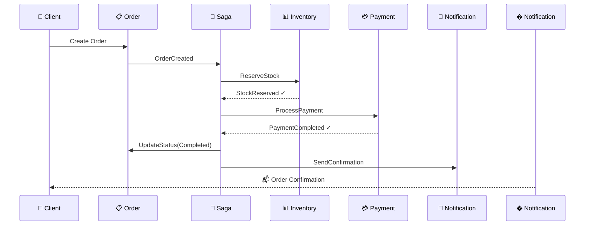

<div align="center">

# 🛒 MicroECommerce

**A Modern Microservices E-Commerce Platform**

[](https://dotnet.microsoft.com/)
[](https://www.postgresql.org/)
[](https://redis.io/)
[](https://www.rabbitmq.com/)
[](https://www.docker.com/)

[Features](#-features) • [Architecture](#-architecture) • [Quick Start](#-quick-start) • [API Reference](#-api-reference) • [Contributing](#-contributing)

</div>

---

## ✨ Features

<table>
<tr>
<td width="50%">

### 🏛️ Clean Architecture
- Domain-Driven Design principles
- CQRS with MediatR
- Repository pattern with EF Core

</td>
<td width="50%">

### 🔄 Saga Orchestration  
- Distributed transactions
- Automatic rollback on failure
- Event-driven communication

</td>
</tr>
<tr>
<td width="50%">

### 🔐 Security First
- JWT authentication
- Role-based authorization
- Rate limiting at gateway

</td>
<td width="50%">

### 📊 Full Observability
- Centralized logging (Seq)
- Distributed tracing (Jaeger)
- Health checks per service

</td>
</tr>
</table>

---

## 🏗️ Architecture

```
                              ┌─────────────────────────────────────┐
                              │         🌐 API Gateway (YARP)        │
                              │    Rate Limiting • Auth • Routing    │
                              └──────────────────┬──────────────────┘
                                                 │
         ┌───────────┬───────────┬───────────────┼───────────────┬───────────┬───────────┐
         │           │           │               │               │           │           │
         ▼           ▼           ▼               ▼               ▼           ▼           ▼
    ┌─────────┐ ┌─────────┐ ┌─────────┐    ┌─────────┐    ┌─────────┐ ┌─────────┐ ┌─────────┐
    │   🔑    │ │   📦    │ │   📋    │    │   💳    │    │   📊    │ │   🛒    │ │   📧    │
    │Identity │ │ Catalog │ │  Order  │    │ Payment │    │Inventory│ │ Basket  │ │ Notify  │
    │   API   │ │   API   │ │   API   │    │   API   │    │   API   │ │   API   │ │   API   │
    └────┬────┘ └────┬────┘ └────┬────┘    └────┬────┘    └────┬────┘ └────┬────┘ └────┬────┘
         │           │           │               │               │           │           │
         │           │           └───────────────┼───────────────┘           │           │
         │           │                           │                           │           │
         │           │              ┌────────────┴────────────┐              │           │
         │           │              │       🐰 RabbitMQ       │              │           │
         │           │              │    (MassTransit Saga)   │              │           │
         │           │              └─────────────────────────┘              │           │
         │           │                                                       │           │
    ┌────┴───────────┴───────────────────────────────────────────────────────┴───────────┴────┐
    │                                    🐘 PostgreSQL                                         │
    └──────────────────────────────────────────────────────────────────────────────────────────┘
```

---

## 🛠️ Tech Stack

<div align="center">

| Layer | Technologies |
|:-----:|:-------------|
| **Backend** |   |
| **Database** |   |
| **Messaging** |  MassTransit |
| **Gateway** | YARP Reverse Proxy |
| **Observability** | Serilog • Seq • OpenTelemetry • Jaeger |
| **DevOps** |  Docker Compose |

</div>

---

## 📁 Project Structure

```
📦 MicroECommerce
├── 🌐 src/ApiGateway/              # YARP reverse proxy
├── 🧱 src/BuildingBlocks/          # Shared libraries
│   ├── Core/                       # Base entities, interfaces
│   ├── CrossCutting/               # Exception middleware
│   ├── Infrastructure/             # EF Core base repository
│   ├── Logging/                    # Serilog config
│   ├── Messaging/                  # MassTransit, events
│   └── Security/                   # JWT utilities
└── 🔧 src/Services/
    ├── 🛒 Basket/                  # Shopping cart (Redis)
    ├── 📦 Catalog/                 # Products & categories
    ├── 🔑 Identity/                # Auth & users
    ├── 📊 Inventory/               # Stock management
    ├── 📧 Notification/            # Email service
    ├── 📋 Order/                   # Order processing + Saga
    └── 💳 Payment/                 # Payment gateway (mock)
```

<details>
<summary><b>📐 Service Architecture (Clean Architecture)</b></summary>

```
Service/
├── 🎯 API/                    # Controllers, Program.cs
├── 📝 Application/            # CQRS handlers, DTOs, validators
├── 🏛️ Domain/                 # Entities, enums, domain events
└── 🔧 Infrastructure/         # DbContext, repositories
```

</details>

---

## 🚀 Quick Start

### Prerequisites

- 🐳 Docker & Docker Compose
- 💻 .NET 10 SDK *(for local dev)*

### Run with Docker

```bash
# Clone the repository
git clone https://github.com/yourusername/MicroECommerce.git
cd MicroECommerce

# Copy environment file
cp .env.example .env

# 🚀 Start all services
docker-compose up -d

# Check status
docker-compose ps
```

### 🌐 Access Points

| Service | URL | Credentials |
|---------|-----|-------------|
| 🌐 API Gateway | http://localhost:5000 | - |
| 📋 Swagger | http://localhost:{port}/swagger | - |
| 📊 Seq (Logs) | http://localhost:9090 | - |
| 🔍 Jaeger (Traces) | http://localhost:16686 | - |
| 🐰 RabbitMQ | http://localhost:15672 | guest / guest |

---

## 📡 API Reference

### 🔑 Identity

| Method | Endpoint | Description |
|:------:|----------|-------------|
| `POST` | `/api/auth/register` | Register new user |
| `POST` | `/api/auth/login` | Get JWT token |
| `POST` | `/api/auth/refresh` | Refresh token |

### 📦 Catalog

| Method | Endpoint | Auth | Description |
|:------:|----------|:----:|-------------|
| `GET` | `/api/product` | ❌ | List products |
| `GET` | `/api/product/{id}` | ❌ | Get product details |
| `POST` | `/api/product` | 🔐 Admin | Create product |
| `PUT` | `/api/product` | 🔐 Admin | Update product |
| `DELETE` | `/api/product/{id}` | 🔐 Admin | Delete product |

### 📋 Order

| Method | Endpoint | Auth | Description |
|:------:|----------|:----:|-------------|
| `POST` | `/api/order` | ✅ | Create order |
| `GET` | `/api/order/{id}` | ✅ | Get order |
| `GET` | `/api/order/my-orders` | ✅ | List user orders |

### 🛒 Basket

| Method | Endpoint | Auth | Description |
|:------:|----------|:----:|-------------|
| `GET` | `/api/basket/{userName}` | ✅ | Get basket |
| `POST` | `/api/basket` | ✅ | Update basket |
| `POST` | `/api/basket/checkout` | ✅ | Checkout |
| `DELETE` | `/api/basket/{userName}` | ✅ | Clear basket |

---

## 🔄 Order Saga Flow



---

## 📊 Observability

<table>
<tr>
<td align="center" width="33%">

### � Logging
**Seq Dashboard**  
Centralized structured logs

`http://localhost:9090`

</td>
<td align="center" width="33%">

### 🔍 Tracing
**Jaeger UI**  
Distributed request tracing

`http://localhost:16686`

</td>
<td align="center" width="33%">

### ❤️ Health
**Health Checks**  
Per-service health endpoints

`/health`

</td>
</tr>
</table>

---

## 🧪 Development

```bash
# Build entire solution
dotnet build MicroECommerce.slnx

# Run specific service
cd src/Services/Order/Order.API
dotnet run

# Run tests
dotnet test
```

---

## 🤝 Contributing

Contributions are welcome! Please feel free to submit a Pull Request.

1. Fork the repository
2. Create your feature branch (`git checkout -b feature/AmazingFeature`)
3. Commit your changes (`git commit -m 'Add some AmazingFeature'`)
4. Push to the branch (`git push origin feature/AmazingFeature`)
5. Open a Pull Request

---

<div align="center">

**Built with ❤️ using .NET 10**

⭐ Star this repo if you find it helpful!

</div>
